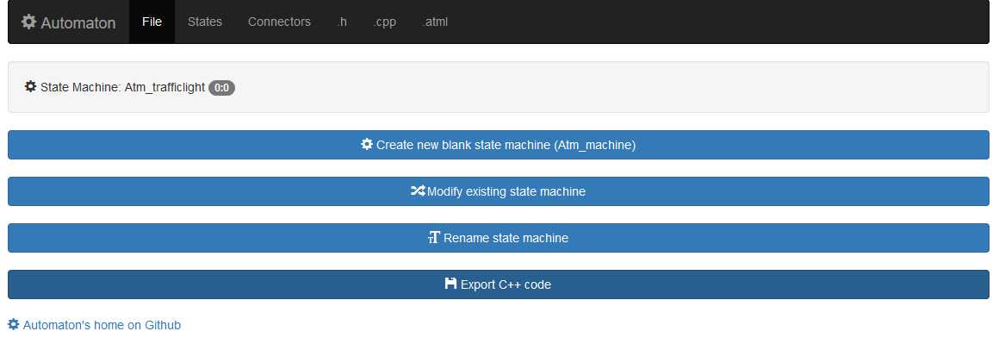
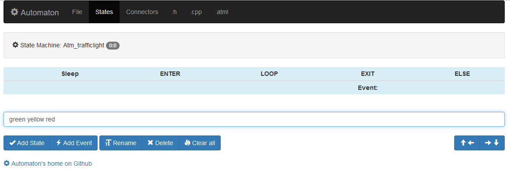
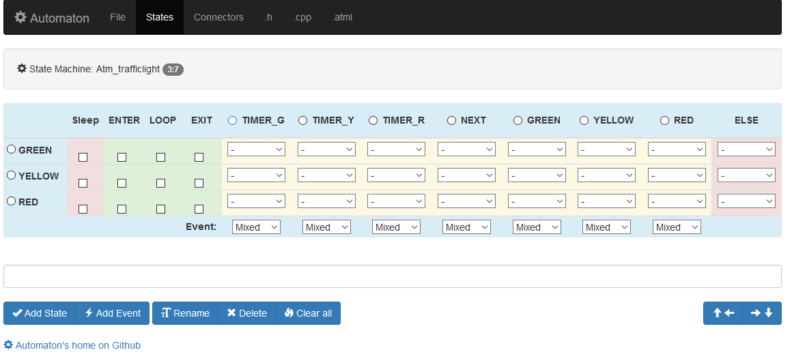
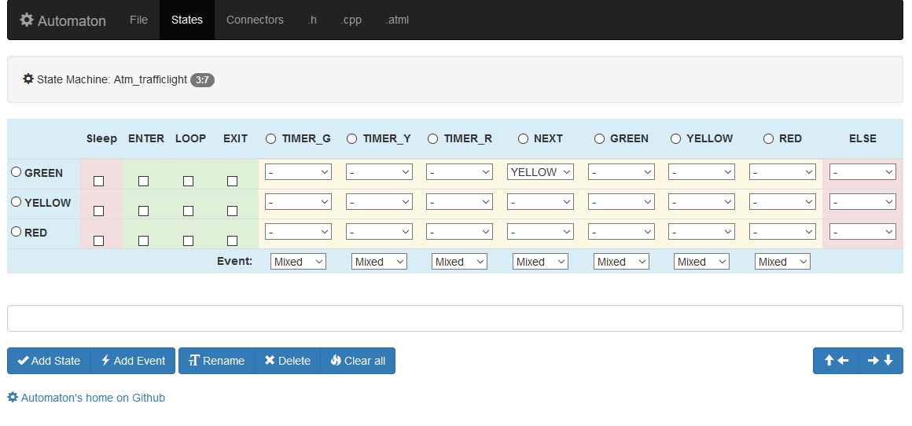
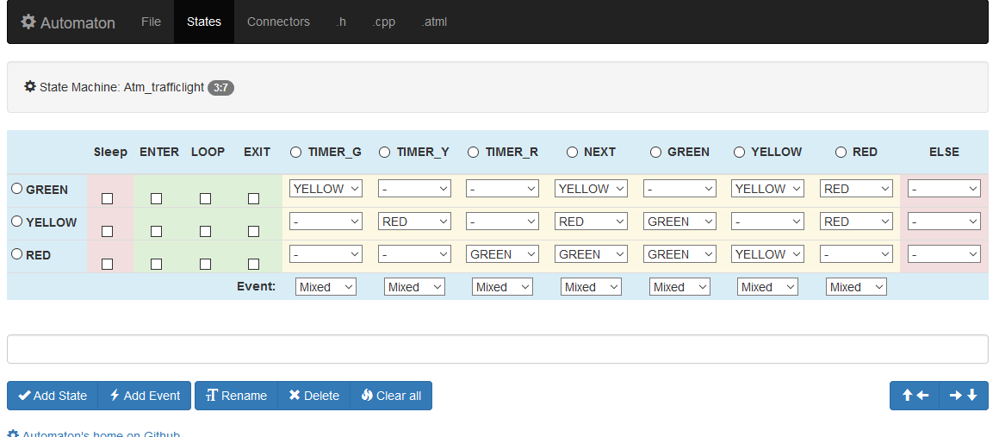
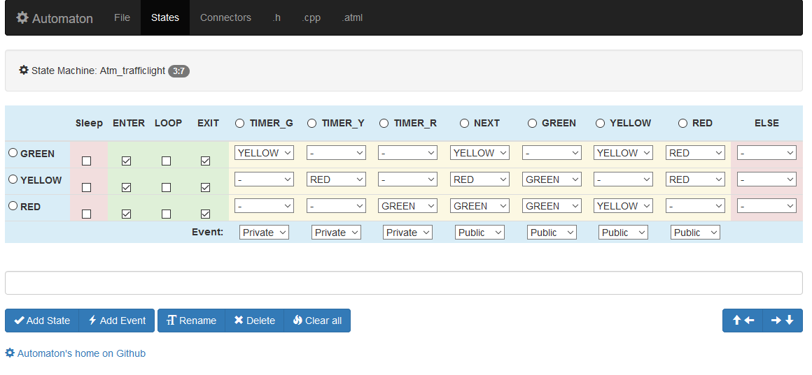
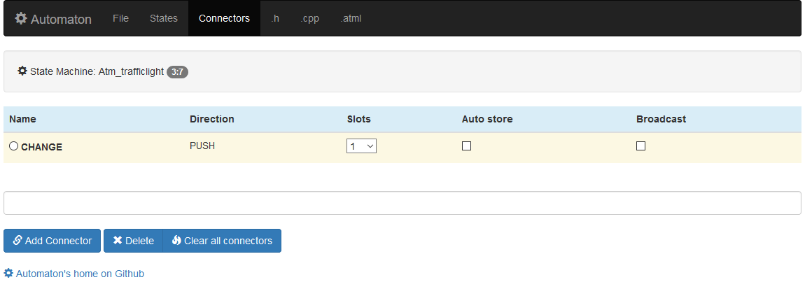
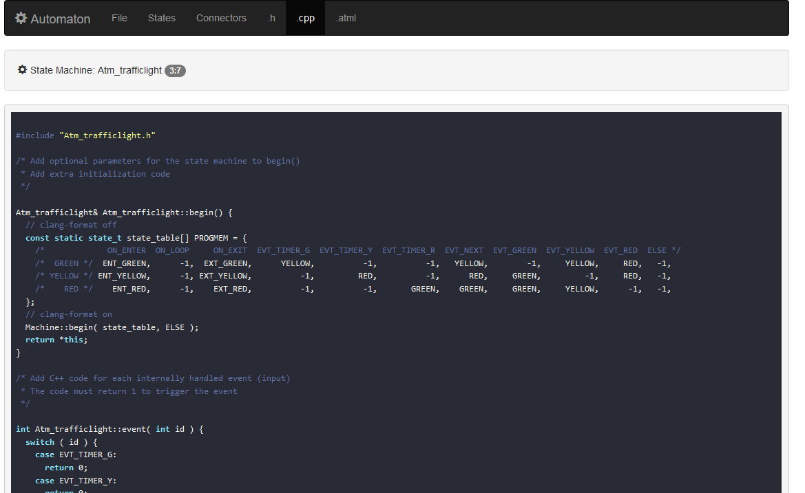
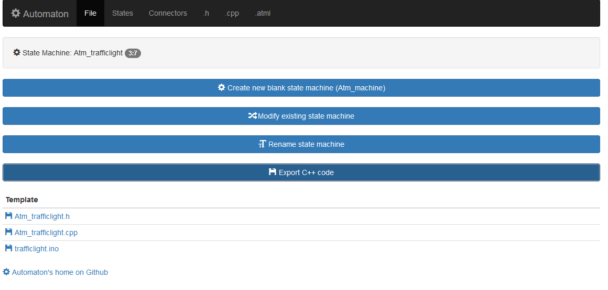

* [The Machine Editor](#the-machine-editor)
* [Creating the States](#creating-the-states)
* [Creating the Events](#creating-the-events)
* [Linking the Events with the States](#linking-the-events-with-the-states)
* [Creating the Action Handlers](#creating-the-action-handlers)
* [Adding the Push Connector](#adding-the-push-connector)
* [Generating the Code](#generating-the-code)

This tutorial demonstrates the process of building a custom Automaton component (state machine) using the [Machine Editor](http://www.wolkendek.nl/atm/). The Machine Editor is a tool for creating a state machine template. It takes care of most of the grunt work involved in building a machine. The Editor produces templates that normally just require some editing to customize the begin(), event() and action() methods.

We use an object most of us encounter every day as our subject, a traffic light. Our goal is to create a 
traffic light state machine that can be controlled with commands (or events) so it will easily integrate
with the other Automaton state machines so that we can change its phase with a button press. We also want an automatic mode so that the light will be able to cycle through its phases on its own. We use the light sequence: Green -> Yellow -> Red -> Green.



### The Machine Editor

To start building the state machine template go to [http://wolkendek.nl/atm/](http://wolkendek.nl/atm/) and press the *Create new blank state machine* button. Then think of a good name for your machine 
(Atm_trafficlight would be a good one) and press *Rename state machine*. The Machine editor is now ready to start defining your machine. Click the *States* option in the top menu to enter the state table editor.



### Creating the States

A Dutch traffic light only has three phases, one for each of the colors. We create a state for each color. Type the traffic light colors (green, yellow, red) in the text field and press the *Add State* button. You may enter one or more state names in the field as long as they are separated by white space or commas. The State Table Editor will update the table to show the new states, with every state in its own row.


### Creating the Events

Our traffic light state machine will also need events. Events are conditions that will cause the machine to change its state. We need two types of events, timers to make the light change automatically and 'external' events that can be triggered from the outside. We want to be able to give the machine a ```c++ machine.next()``` command to make it advance through the light sequence. We'll need three timers ( timer_g, timer_y, timer_r ) for each of the states and we'll need the following public events: next, green, yellow, red. Enter them in the text field and press the *Add event* button.
 


### Linking the Events with the States

The State Table Editor has now reached its full dimensions. You can see the state names on the left in the blue column and the events in the top row as the column titles. The yellow columns contain the real events (Public as well as private) while the column on the right contains the unconditional ELSE pseudo event. The yellow area in the table is the location where the relations between states and events are configured. If we want the machine to change from the green to the yellow state on receipt of the *NEXT* event we change the select box underneath the NEXT event in the GREEN row to YELLOW. 



For the timers we do something similar. When the timer_g timer expires in the GREEN state we move to the YELLOW state. (select YELLOW in the GREEN row under the TIMER_G event). After filling in all the state/event relations we end up with the following result.



### Creating the Action Handlers

The check boxes in the green table area are for creating action handlers. If our state machine should have any outside effects this is where we create the handlers for them. Our machine will switch a led on when it enters a state and will switch it off again when it leaves the state. So we check the *ENTER* and *EXIT* handlers for each state. Another thing we need to do is classify the events, by default they're all mixed, but we want the timers marked as *Private* and the other events marked as *Public* because they are triggered from outside the machine. For this machine we do nothing with the *Sleep* and *ELSE* columns.



### Adding the Push Connector

That concludes our business with the State Table Editor. There's one thing left to add to our traffic light machine. Most Automaton state machines have on* methods ( like onPress(), onTimer() or onChange() ) to communicate changes in the state machine to the outside world. The button machine can call a callback function or send and EVT_ON event to a led machine in response to a button press. In order to communicate a change in the state of our traffic light we want to add an onChange() method to the machine. We call this type of communication function a *Push connector*. Click on the *Connectors* option in the top menu, enter 'change' in the text field and press *Add connector* leave the number of slots at '1' and the other options unchecked.



### Generating the Code

The Machine Editor is ready to generate the code template. Click on the '.cpp' option in the top menu to admire the result. 



Now click on the *File* option in the top menu and export the Atm_trafficlight.cpp, Atm_trafficlight.h and trafficlight.ino files. Save all three files in a folder called 'trafficlight' in your local Arduino folder.




### To be continued...
