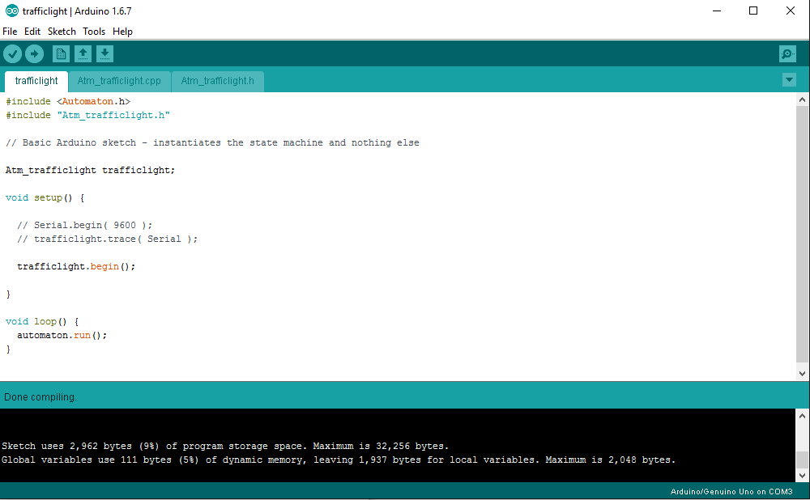

### The Traffic Light Machine

This tutorial demonstrates the process of building a custom Automaton component (state machine) using the [Machine Editor](http://www.wolkendek.nl/atm/). The Machine Editor is a tool for creating state machine templates. It takes care of most of the grunt work involved in building a machine. The Editor produces templates that normally just require some editing to customize the begin(), event() and action() methods. 

We use an object most of us encounter every day as our subject, a traffic light. Our goal is to create a 
traffic light state machine that can be controlled with commands (or events) so it will easily integrate
with the other Automaton state machines so that we can change its phase with a button press. We also want an automatic mode so that the light will be able to cycle through its phases on its own. We use the light sequence: Green -> Yellow -> Red -> Green.

* [The Machine Editor](#the-machine-editor)
* [Creating the States](#creating-the-states)
* [Creating the Events](#creating-the-events)
* [Linking the Events with the States](#linking-the-events-with-the-states)
* [Creating the Action Handlers](#creating-the-action-handlers)
* [Adding a Push Connector](#adding-a-push-connector)
* [Generating the Code](#generating-the-code)
* [First Compile](#first-compile)
* [Adapting the Event Handler](#adapting-the-event-handler)
* [Adapting the Action Handler](#adapting-the-action-handler)
* [Adding the automatic() method](#adding-the-automatic-method)
* [Controlling the traffic light with a button](#controlling-the-traffic-light-with-a-button)
* [Controlling the traffic light with a web browser](#controlling-the-traffic-light-with-a-web-browser)

### The Machine Editor


To start building the state machine template go to [http://wolkendek.nl/atm/](http://wolkendek.nl/atm/) and press the *Create new blank state machine* button. Then think of a good name for your machine 
(I strongly suggest Atm_trafficlight to match the rest of the tutorial) and press *Rename state machine*. The Machine editor is now ready to start defining your machine. Click the *States* option in the top menu to enter the state table editor.


### Creating the States

A Dutch traffic light only has three phases, one for each of the colors. We create a state for each color. Type the traffic light colors (green, yellow, red) in the text field and press the *Add State* button. You may enter one or more state names in the field as long as they are separated by white space or commas. The State Table Editor will update the table to show the new states, with every state in its own row.


### Creating the Events

Our traffic light state machine will also need events. Events are conditions that will cause the machine to change its state. We need two types of events, timers to make the light change automatically and 'external' events that can be triggered from the outside. We want to be able to give the machine a ``` machine.next()``` command to make it advance through the light sequence. We'll need three timers ( timer_g, timer_y, timer_r ) for each of the states and we'll need the following public events: next, green, yellow, red. Enter them in the text field and press the *Add event* button.
 


### Linking the Events with the States

The State Table Editor has now reached its full dimensions. You can see the state names on the left in the blue column and the events in the top row as the column titles. The yellow columns contain the real events (Public as well as private) while the column on the right contains the unconditional ELSE pseudo event. The yellow area in the table is the location where the relations between states and events are configured. If we want the machine to change from the green to the yellow state on receipt of the *NEXT* event we change the select box underneath the NEXT event in the GREEN row to YELLOW. 


For the timers we do something similar. When the timer_g timer expires in the GREEN state we move to the YELLOW state. (select YELLOW in the GREEN row under the TIMER_G event). After filling in all the state/event relations we end up with the following result.


### Creating the Action Handlers

The check boxes in the green table area are for creating action handlers. If our state machine should have any outside effects this is where we create the handlers for them. Our machine will switch a led on when it enters a state and will switch it off again when it leaves the state. So we check the *ENTER* and *EXIT* handlers for each state. Another thing we need to do is classify the events, by default they're all mixed, but we want the timers marked as *Private* and the other events marked as *Public* because they are triggered from outside the machine. For this machine we do nothing with the *Sleep* and *ELSE* columns.


The picture above gives a clear overview of the basic structure of our state machine.

### Adding a Push Connector

That concludes our business with the State Table Editor. There's one thing left to add to our traffic light machine. Most Automaton state machines have on* methods (like onPress, onTimer or onChange) to communicate changes in the state machine to the outside world. The button machine can call a callback function or send and EVT_ON event to a led machine in response to a button press. In order to communicate a change in the state of our traffic light we want to add an onChange() method to the machine. We call this type of communication function a *Push connector*. Click on the *Connectors* option in the top menu, enter 'change' in the text field and press *Add connector* leave the number of slots at '1' and the other options unchecked.


### Generating the Code

The Machine Editor is ready to generate the code template. Click on the '.cpp' option in the top menu to admire the result. 


Now click on the *File* option in the top menu and export the Atm_trafficlight.cpp, Atm_trafficlight.h and trafficlight.ino files. Save all three files in a folder called 'trafficlight' in your local Arduino folder.


### First Compile

Load the trafficlight.ino sketch in the Arduino IDE and press the *verify/compile* or *Upload* button.



 The sketch should compile without errors but it won't do anything yet. For that we have to fill in some blanks.

### Adapting the begin() method

To implement a traffic light we'll need to be able to pass the pins for each light to the machine in the begin method call, like this:

```c++
  trafficlight.begin( 4, 5, 6 );
```

We need to modify the begin() method to handle that. We'll also add some code to put the pins in OUTPUT mode and initialize the Automaton timer objects. In the Atm_trafficlight.cpp file we edit the begin() method declaration:

```c++
Atm_trafficlight& Atm_trafficlight::begin( int pin_g, int pin_y, int pin_r ) {
```

And furher down in the body of the method:

```c++
  Machine::begin( state_table, ELSE );
  this->pin_g = pin_g; // Save the pins
  this->pin_y = pin_y;
  this->pin_r = pin_r;
  pinMode( pin_g, OUTPUT ); // Set the pin modes
  pinMode( pin_y, OUTPUT );
  pinMode( pin_r, OUTPUT );
  timer_g.set( -1 ); // Initialize the timers
  timer_y.set( -1 );
  timer_r.set( -1 );
  return *this;          
}
```

We also have to change the declaration in the Atm_trafficlight.h file to match this and while we're at it add the (private) variables we need to store the pins and timers as well:

```c++
  // In Atm_trafficlight.h
  Atm_trafficlight& begin( int pin_g, int pin_y, int pin_r );

 private:
  int pin_g, pin_y, pin_r;
  atm_timer_millis timer_g, timer_y, timer_r;
```  

Lastly, change the begin() method call in trafficlight.ino to ``` trafficlight.begin( 4, 5, 6 ); ``` or something similar.

The sketch should now compile without errors, but it still won't do anything useful...

### Adapting the event() handler

The event() handler is called by the state machine cycle method to check if any of the events specified in the state table have occured. The Machine Editor sets it up for us with the id's of the events that should be handled. 

```c++
/* Add C++ code for each internally handled event (input) 
 * The code must return 1 to trigger the event
 */

int Atm_trafficlight::event( int id ) {
  switch ( id ) {
    case EVT_TIMER_G:
      return 0;
    case EVT_TIMER_Y:
      return 0;
    case EVT_TIMER_R:
      return 0;
  }
  return 0;
}
```

In this case all (private) events are timers. An Automaton timer is checked by calling its expired() method with a reference to the machine object as an argument so this is all that's required to handle them:

```c++
int Atm_trafficlight::event( int id ) {
  switch ( id ) {
    case EVT_TIMER_G:
      return timer_g.expired( this );
    case EVT_TIMER_Y:
      return timer_y.expired( this );
    case EVT_TIMER_R:
      return timer_r.expired( this );
  }
  return 0;
}
```

### Adapting the action() handler

The action() handler is where the action takes place. The Machine Editor sets up an empty handler for us with entries for all the checked actions in the state table.

```c++ 
/* Add C++ code for each action
 * This generates the 'output' for the state machine
 *
 * Available connectors:
 *   push( connectors, ON_CHANGE, 0, <v>, <up> );
 */

void Atm_trafficlight::action( int id ) {
  switch ( id ) {
    case ENT_GREEN:
      return;
    case EXT_GREEN:
      return;
    case ENT_YELLOW:
      return;
    case EXT_YELLOW:
      return;
    case ENT_RED:
      return;
    case EXT_RED:
      return;
  }
}
```

In our machine when the machine enters a state (ENT_) the matching led must be turned on and when it leaves the state (EXT_) the matching led should be turned off again. Like this:

```c++ 
void Atm_trafficlight::action( int id ) {
  switch ( id ) {
    case ENT_GREEN:
      digitalWrite( pin_g, HIGH );
      return;
    case EXT_GREEN:
      digitalWrite( pin_g, LOW );
      return;
    case ENT_YELLOW:
      digitalWrite( pin_y, HIGH );    
      return;
    case EXT_YELLOW:
      digitalWrite( pin_y, LOW );    
      return;
    case ENT_RED:
      digitalWrite( pin_r, HIGH );    
      return;
    case EXT_RED:
      digitalWrite( pin_r, LOW );    
      return;
  }
}
```

We also wanted the state machine to generate events whenever a state change took place. The Machine Editor lists the push connector(s) available in the preceding comment. We just copy & paste it and edit the value to be passed to match the state ( 0, 1 & 2 ).

```c++ 
void Atm_trafficlight::action( int id ) {
  switch ( id ) {
    case ENT_GREEN:
      digitalWrite( pin_g, HIGH );
      push( connectors, ON_CHANGE, 0, 0, 0 );
      return;
    case EXT_GREEN:
      digitalWrite( pin_g, LOW );
      return;
    case ENT_YELLOW:
      digitalWrite( pin_y, HIGH );    
      push( connectors, ON_CHANGE, 0, 1, 0 );
      return;
    case EXT_YELLOW:
      digitalWrite( pin_y, LOW );    
      return;
    case ENT_RED:
      digitalWrite( pin_r, HIGH );    
      push( connectors, ON_CHANGE, 0, 2, 0 );
      return;
    case EXT_RED:
      digitalWrite( pin_r, LOW );    
      return;
  }
}
```

### Adding the automatic() method

We have no way of setting the timers yet so we need to add a custom method for that, just below the action() method:

```c++
Atm_trafficlight& Atm_trafficlight::automatic( int g, int y, int r ) {
  timer_g.set( g );
  timer_y.set( y );
  timer_r.set( r );
  return *this;
}
```
With a matching entry in ```Atm_trafficlight.h```:

```c++
 public:
  Atm_trafficlight& automatic( int g, int y, int r );
```

This completes our state machine. By setting the trafficlight object in the trafficlight.ino sketch to automatic we can now see the light automatically cycling from green to yellow to red and back to green just as we configured it above in the state table.

```c++
#include <Automaton.h>
#include "Atm_trafficlight.h"

Atm_trafficlight trafficlight;

void setup() {

  // Serial.begin( 9600 );
  // trafficlight.trace( Serial );

  trafficlight.begin( 4, 5, 6 ) // Pins 4, 5 & 6
    .automatic( 5000, 2000, 5000 ); // Green 5s, yellow 2s, red 5s

}

void loop() {
  automaton.run();
}
```

You can download the completed files for the state machine here:  
https://gist.github.com/tinkerspy/6ca5ad01e9a3477658b32c1b36e4bad9

Our traffic light state machine is now ready to function in a reactive multi-tasking environment. It can generate events to control other machines and in itself be controlled by other machines all without taking up more than the tiniest slice of microcontroller time.

### Controlling the traffic light with a button

```c++
#include <Automaton.h>
#include "Atm_trafficlight.h"

Atm_trafficlight trafficlight;
Atm_button button;

void setup() {

  trafficlight.begin( 4, 5, 6 ); // Pins 4, 5 & 6

  button.begin( 2 )
   .onPress( trafficlight, trafficlight.EVT_NEXT );
}

void loop() {
  automaton.run();
}
```

The button machine on pin 2 sends an EVT_NEXT event to the trafficlight whenever the button is pressed, cycling manually through the phases.

We can also do a half automatic mode:

```c++
#include <Automaton.h>
#include "Atm_trafficlight.h"

Atm_trafficlight trafficlight;
Atm_button button_g, button_r;

void setup() {

  trafficlight.begin( 4, 5, 6 )
    .automatic( -1, 2000, -1 );

  button_g.begin( 2 )
   .onPress( trafficlight, trafficlight.EVT_GREEN );
  button_r.begin( 3 )
    .onPress( trafficlight, trafficlight.EVT_YELLOW );
}

void loop() {
  automaton.run();
}
```

The automatic timers for red & green are disabled (-1), the timer for yellow is at 2 seconds. When a user presses the button on pin 3 the light will switch to yellow and then advance to red after two seconds. When the user presses the button on pin 2 the light will immediately switch to green.

### Controlling the traffic light with a web browser

The advantage of building state machine components this way is that they integrate seamlessly with all the other Automaton components like the Esp8266 server state machines. Creating a web connecting traffic light becomes real easy now...


```c++
#include <Automaton.h>
#include <Atm_esp8266.h>
#include "Atm_trafficlight.h"

// Control a traffic light with a webserver.

Atm_trafficlight trafficlight;
Atm_esp8266_wifi wifi;
Atm_esp8266_httpd_simple server( 80 );

void setup() {
  Serial.begin( 9600 );
  Serial.println( "Connecting to WIFI" );

  // The traffic light to be controlled on pins D5, D6 & D7

  trafficlight.begin( D5, D6, D7 );
	
  // The Wifi machine manages the wifi connection
  
  wifi.begin( "MySSID", "MyPASSWORD" ) 
    .onChange( true, [] ( int idx, int v, int up  ) {
      Serial.print( "Connected to Wifi, browse to http://");
      Serial.println( wifi.ip() );
      server.start();
    })
    .start();

  // The Http server machine handles incoming requests

  server.begin() 
    .onRequest( "/red", trafficlight, trafficlight.EVT_RED )
    .onRequest( "/yellow", trafficlight, trafficlight.EVT_YELLOW )
    .onRequest( "/green", trafficlight, trafficlight.EVT_GREEN )
    .onRequest( "/next", trafficlight, trafficlight.EVT_NEXT );
}

void loop() {
  automaton.run();
}
```

Now our traffic light is being controlled with a web browser via the urls below (use the ip address assigned
to the esp8266 instead of '123.124.125.126'):

```
http://123.124.125.126/red
http://123.124.125.126/yellow
http://123.124.125.126/green
http://123.124.125.126/next
```
The web server wil respond with a simple 'OK' and send the event to our traffic light machine. It's trivial to expand this example to two traffic light objects controlled by the same esp8266, but I'll leave that as an exercise to the reader.


