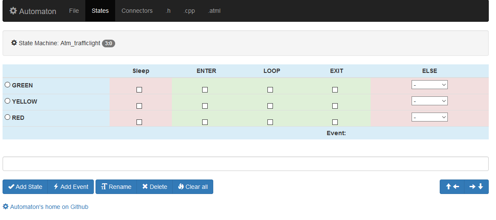

This tutorial demonstrates the process of building a custom Automaton component (state machine) using the [Machine Editor](http://www.wolkendek.nl/atm/). The Machine Editor is a tool for creating a state machine template. I takes care of most of the grunt work involved in building a machine. The Editor produces templates that normally just require some editing to customize the begin(), event() and action() methods.

We use an object most of us encounter every day as a subject, a traffic light. Our goal is to create a 
traffic light state machine that can be controlled with commands (or events) so it will easily integrate
with the other Automaton state machines. We also want an automatic mode so that the light will be able 
to cycle through its phases on its own. We use the Dutch traffic light sequence: Green -> Yellow -> Red -> Green.

To start building the state machine template go to [http://wolkendek.nl/atmdev/index.php](http://wolkendek.nl/atmdev/index.php) and press the *Create new blank state machine* button. Then think of a good name for your machine 
(Atm_trafficlight would be a good one) and press *Rename state machine*. The Machine editor is now ready to start defining your machine. Click the *States* option in the top menu to enter the state table editor.

A Dutch traffic light only has three phases, one for each of the colors. We create a state for each color. Type the traffic light colors (green, yellow, red) in the text field and press the *Add State* button. You may enter one or more state names in the field as long as they are separated by white space or commas. The State Table Editor will update the table to show the new states, with every state in its own row.

