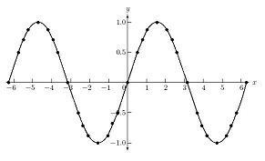

This state machine monitors an analog input with a configurable sample period and fires off an optional callback whenever its value changes. Optionally keeps a moving average to smooth out peaks and troughs. The analog machine is great for monitoring potmeters.



<!-- md-tocify-begin -->
* [begin()](#atm_analog--begin-int-attached_pin-int-samplerate--50-)  
* [onChange()](#atm_analog--onchange-connector-connector-arg-)  
* [average()](#atm_analog--average-uint16_t--v-uint16_t-size-)  
* [range()](#atm_analog--range-int-tolow-int-tohigh-)  
* [state()](#int-state-void-)  
* [trace()](#atm_analog--trace-stream--stream-)  

<!-- md-tocify-end -->

## Synopsis ##

```c++
#include <Automaton.h>

// A software thermostat monitors a sensor and controls a heater 

Atm_analog thermometer;
Atm_controller thermostat;
Atm_led heater;
Appliance app;

void setup() {
  // Heater controlled by pin 4
  app.component( heater.begin( 4 ) ); 

  // Temperature sensor on analog pin A0
  app.component( thermometer.begin( A0 ) ); 

  // Link them with a controller
  app.component( 
    thermostat.begin()
      .IF( thermometer, '<', 500 )
      .onChange( true, heater, heater.EVT_ON )
      .onChange( false, heater, heater.EVT_OFF )
  );

}

void loop() {
  app.run();
}
```
An analog machine ('thermometer') monitors a thermosensor on pin A0. A controller machine monitors the thermometer machine and turns a heater on (actually a led machine connected to pin 4) whenever the temperature reading drops below 500.

### Atm_analog & begin( int attached_pin, int samplerate = 50 ) ###

Attaches the analog machine to an analog input pin and sets the sample period. The sample period is in milliseconds per sample.

```c++
Atm_analog sensor;

void change_callback( int idx, int v, int up ) {
  // Do something when the analog value changes

}

void setup() {
  ...
  sensor.begin( A0, 50 )
    .onChange( change_callback, 3 );
  ...
}
```

The callback has 3 arguments:

Argument | Function
-------- | --------
idx | the index parameter passed to the onChange() method
v | the last measured value (or moving average)
up  | The direction in which the value changed (1 = up, 0 = down)


### Atm_analog & onChange( {connector}, {connector-arg} ) ###

Specify a machine or callback to be triggered whenever the analog value changes. The change is relative to the range() setting, so if the range is set to 0, 10 and the analog pin value changes slowly from 0 to 1023 the connector will only activate 10 times.

```c++
void setup() {

  app.component( 
    buzzer.begin( 4 )
      .blink( 10, 0, 1 )
  );

  app.component( 
    sensor.begin( A0, 50 )
      .range( 0, 10 );
      .onChange( buzzer, buzzer.EVT_BLINK )
  );

}
```

### Atm_analog & average( uint16_t * v, uint16_t size ) ###

Connects an averaging buffer to the state machine. This will cause the state machine to monitor a *moving average* instead of the momentary value. Tune the size of this buffer and the sample rate to get the smoothing behavior you want.

```c++
uint16_t avgbuffer[256];

void setup() {
  app.component( 
    sensor.begin( A0, 50 )
      .average( avgbuffer, 256 )
  );
}
```
The buffer variable is used as a ring buffer to store the sampled values. The value the analog machine returns  is computed as the average of the values in the ring buffer. The call to average() fills up the ringbuffer with samples so that the reading will make sense right from the start.

### Atm_analog & range( int toLow, int toHigh ) ###

Maps the analog readings to a different range.

```c++
#include <Automaton.h>

// Control the speed of a blinking led with a pot

Atm_analog pot;
Atm_led led;
Appliance app;

void setup() {
  app.component( 
    led.begin( 4 )
      .trigger( led.EVT_BLINK )
  );
  app.component( 
    pot.begin( A0 )
      .range( 10, 100 )
      .onChange( []( int idx, int v, int up ) {
         led.blink( v, v );    
      })
  );
}

void loop() {
  app.run();
}
```
This also affects the onChange() connector.

### int state( void ) ###

Returns the value (or moving average) of the analog pin monitored. Affected by the range() method.

### Atm_analog & trace( Stream & stream ) ###

To monitor the behavior of this machine you may log state change events to a Stream object like Serial.

```c++
Serial.begin( 9600 );
cmp.trace( Serial );
```

**WARNING: This machine changes state for every sample taken and will produce a lot of log output quickly**

