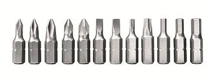

This state machine manages 1 bit of information, be it True/False, High/Low or 1/0. The value of the machine can be set by triggering events. The bit machine can take action when its value (state) changes. This is a useful component in many applications. Also serves as a conditional gate with the onInput() connector.



<!-- md-tocify-begin -->
* [begin()](#atm_bit--begin-bool-default_state--false-)  
* [onChange()](#atm_bit--onchange-connector-connector-arg-)  
* [onInput()](#atm_bit--oninput-bool-cur_state-connector-connector-arg-)  
* [led()](#atm_bit--led-int-pin-activelow--false-)  
* [state()](#int-state-void-)  
* [trace()](#atm_bit--trace-stream--stream-)  

<!-- md-tocify-end -->

## Synopsis ##

```c++
#include <Automaton.h>

Atm_button button;
Atm_bit toggle;
Atm_led led;

void setup() {
  led.begin( 4 ); // LED controlled by pin 4

  button.begin( 2 ) // Button on pin 2
    .onPress( toggle, toggle.EVT_TOGGLE );

  toggle.begin() // Bit machine stores the toggle state
    .onChange( true, led, led.EVT_ON ) // And turns the led on and off
    .onChange( false, led, led.EVT_OFF );

}

void loop() {
  automaton.run();
}
```

### Atm_bit & begin( bool default_state = false ) ###

Inititalizes the bit machine and sets the default state.

### Atm_bit & onChange( {connector}, {connector-arg} ) ###

Specifies a machine or callback to be triggered whenever the bit machine changes state.

```c++
  bit.begin()
    .onChange( led, led.EVT_TOGGLE )
    .trigger( bit.EVT_ON );
```

### Atm_bit & onChange( bool new_state, {connector}, {connector-arg} ) ###

Specifies a machine or callback to be triggered whenever the bit machine changes state to *new_state*.

```c++
  bit.begin()
    .onChange( true, led, led.EVT_ON )
    .onChange( false, led, led.EVT_OFF )
    .trigger( bit.EVT_ON );
```

### Atm_bit & onInput( bool cur_state, {connector}, {connector-arg} ) ###

Specifies a machine or callback to be triggered whenever the bit machine receives an EVT_INPUT event. The machine can be made to respond diferently depending on the current state of the machine. (true or false)

```c++
  bit.begin()
    .onInput( true, led, led.EVT_ON )
    .onInput( false, led, led.EVT_OFF )
    .trigger( bit.EVT_INPUT )
```

### Atm_bit & led( int pin, activeLow = false ) ###

Use the led() method to assign a pin (driving a led or something else) to be used as an state indicator for the bit machine. The bit machine will control the HIGH/LOW state of the pin to match the state of the bit machine. Use it to control a status led that is linked to the state that the bit machine represents. This way you won't need a separate led machine.

```c++
Atm_bit manual;
Atm_button button;

void setup() {

  // The 'manual' button on pin 2
  button.begin( 2 )
    .onPress( manual, manual.EVT_TOGGLE );

  // The 'manual' status led on pin 4
  manual.begin()
    .led( 4 );

  // manual.state() now reflects the status of the 'manual' selector

}

void loop() {
  automaton.run();
}

```

### int state( void ) ###

Returns 0 if the bit is in state LOW (Off/False/0) and 1 if the bit machine is in state HIGH (On/True/1), perfect for using in a controller condition.

```c++
#include <Automaton.h>

Atm_bit bit;
Atm_controller controller;

void setup() {

  bit.begin() 
    .trigger( bit.EVT_ON );

  controller.begin()
    .IF(  bit )
    .onChange( true, buzzer, buzzer.EVT_ON )
    .onChange( false, buzzer, buzzer.EVT_OFF );
}

void loop() {
  automaton.run();
}

```

### Atm_bit & trace( Stream & stream ) ###

To monitor the behavior of this machine you may log state change events to a Stream object like Serial.

```c++
Serial.begin( 9600 );
bit.trace( Serial );
```

