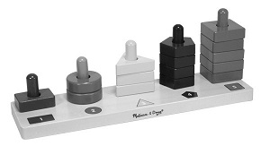

This state machine monitors an analog input with a configurable sample period and fires off a callback whenever one of a list of thresholds are crossed. Optionally keeps a moving average to smooth out peaks and troughs.



<!-- md-tocify-begin -->
* [begin()](#atm_comparator--begin-int-attached_pin-int-samplerate-)  
* [threshold()](#atm_comparator--threshold-uint16_t--v-uint16_t-size-bool-catchup--false-)  
* [onChange()](#atm_comparator--onchange-bool-status-connector-connector-arg-)  
* [average()](#atm_comparator--average-uint16_t--v-uint16_t-size-)  
* [state()](#int-state-void-)  
* [trace()](#atm_comparator--trace-stream--stream-)  

<!-- md-tocify-end -->

## Synopsis ##

```c++
#include <Automaton.h>

Atm_comparator cmp;

void cmp_callback( int idx, int v, int up ) {
  // Do something when one of the thresholds is crossed
  Serial.print( "Value: " );
  Serial.println( v );
}

void setup() {
  Serial.begin( 9600 );
  static uint16_t threshold_list[] = 
    { 100, 200, 300, 400, 500, 600, 700, 800, 900, 1000 }; 

  cmp.begin( A0, 50 )
    .threshold( threshold_list, sizeof( threshold_list ) )
    .onChange( cmp_callback );
}

void loop() {
  automaton.run();
}
```

### Atm_comparator & begin( int attached_pin, int samplerate ) ###

Attaches the comparator to an analog input pin and sets the sample period. The sample period is in milliseconds per sample.

```c++
void cmp_callback( int idx, int v, int up, int idx_threshold, int v_threshold ) {
  // Do something when one of the thresholds is crossed
}

void setup() {
  ...
  cmp.begin( A0, 50 )
    .threshold( threshold_list, sizeof( threshold_list ) )
    .onChange( cmp_callback, 99 )
  ...
}
```

The callback has 5 arguments:

Argument | Function
-------- | --------
idx | The idx value passed to the onChange method (in the example here: 99)
v | the last measured value (or moving average)
up  | The direction in which the threshold was crossed (1 = up, 0 = down)
idx_threshold | The index of the threshold that was crossed
v_threshold | The value of the threshold that was crossed

### Atm_comparator & threshold( uint16_t * v, uint16_t size, bool catchUp = false ) ###

Sets a list of thresholds to monitor. If the measured analog input crosses one of these thresholds the callback is called. Arguments are a pointer to a list of 16 bit unsigned integers and the size of the list.

```c++
void setup() {
  static uint16_t threshold_list[] = 
    { 100, 200, 300, 400, 500, 600, 700, 800, 900, 1000 }; 

    cmp.begin( A0, 50 )
      .threshold( threshold_list, sizeof( threshold_list ), true )
      .onChange( cmp_callback, 99 );
}
```
Declare the list as a global variable or as *static*. The threshold list can hold a maximum of 64 entries.

If the optional catchUp argument is set to `true` the state machine will catch up to the current value as soon as the state machine starts cycling. It does this by calling your callback as many times as necessary if the current value is larger than at least one threshold value. So in the above situation, if you have a thermistor attached to A0 and its current value is 511, the callback will be called 5 times in quick succession, once each for the 100, 200, 300, 400 and 500 threshold values. If catchUp is set to `false` or omitted from the `threshold()` call, when the state machine starts, the callback will not be called until a threshold is crossed.

Compatibility note: Note that the size argument now takes the byte size of the threshold array!

### Atm_comparator & onChange( bool status, {connector}, {connector-arg} ) ###

Specify a machine or callback to be triggered whenever a threshold is crossed in either the upward (status true) or downward (status false) direction.

```c++
void setup() {
  static uint16_t threshold_list[] = 
    { 100, 200, 300, 400, 500, 600, 700, 800, 900, 1000 }; 

  cmp.begin( A0, 50 )
    .threshold( threshold_list,  sizeof( threshold_list ), true )
    .onChange( true, step, step.EVT_STEP )
    .onChange( false, step, step.EVT_BACK );
}

```

### Atm_comparator & onChange( {connector}, {connector-arg} ) ###

Specifies a machine or callback to be triggered whenever the comparator machine crosses any threshold in any direction.

```c++
#include <Automaton.h>

Atm_comparator cmp;

void setup() {
  static uint16_t threshold_list[] = 
    { 100, 200, 300, 400, 500, 600, 700, 800, 900, 1000 }; 

  Serial.begin( 9600 );
  cmp.begin( A0, 50 )
    .threshold( threshold_list,  sizeof( threshold_list ), true )
    .onChange( [] ( int idx, int v, int up ) {
       Serial.println( threshold_list[cmp.lastThreshold()] );
    });
}

void loop() {
  automaton.run();
}
```

### Atm_comparator & average( uint16_t * v, uint16_t size ) ###

Connects an averaging buffer to the state machine. This will cause the state machine to monitor a *moving average* instead of the momentary value. Tune the size of this buffer and the sample rate to get the smoothing behavior you want.

```c++
uint16_t avgbuffer[256];

void setup() {
  static uint16_t threshold_list[] = 
    { 100, 200, 300, 400, 500, 600, 700, 800, 900, 1000 }; 

  cmp.begin( A0, 50 )
    .threshold( threshold_list,  sizeof( threshold_list ), true )
    .average( avgbuffer, sizeof( avgbuffer ) )
    .onChange( cmp_callback );

}
```
The buffer variable is used as a ring buffer to store the sampled values. The value the comparator uses to check the thresholds is computed as the average of the values in the ring buffer. The call to average() fills up the ringbuffer with samples so the average will make sense right from the start.

### int state( void ) ###

Returns the current value (after optional averaging) of the analog input.

### Atm_comparator & trace( Stream & stream ) ###

To monitor the behavior of this machine you may log state change events to a Stream object like Serial.

```c++
Serial.begin( 9600 );
cmp.trace( Serial );
```

**WARNING: This machine changes state for every sample taken and will produce a lot of log output quickly**
