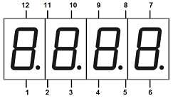

Monitor a digital pin for incoming pulses and fire a callback or trigger a machine when a pulse is detected. A pulse can be either high or low and must be of a minimum duration. With the pullUp parameter Atm_digital can even be used to handle buttons, switches and dip-switches.



<!-- md-tocify-begin -->
* [begin()](#atm_digital--begin-int-attached_pin-int-minimum_duration--20-bool-activelow--false-bool-pullup--false-)  
* [onChange()](#atm_digital--onchange-bool-status-connector-connector-arg-)  
* [led()](#atm_digital--led-int-pin-activelow--false-)  
* [trace()](#machine--trace-stream--stream-)  

<!-- md-tocify-end -->

## Synopsis ##

```c++
#include <Automaton.h>

Atm_digital pulse;
Appliance app;

void pulse_callback( int idx, int v, int up ) {
  // Do something when a pulse of at least 20 ms is detected on pin A0
}

void setup() {
  app.component(
    pulse.begin( A0, 20 )
      .onChange( HIGH, pulse_callback )
  );
}

void loop() {
  app.run();
}
```
Pin A0 (all analog pins can also function as digital inputs) was chosen so that you can test this with the standard example setup which includes a pot on A0. Turn it up and down to simulate a pulse.

### Atm_digital & begin( int attached_pin, int minimum_duration = 20, bool activeLow = false, bool pullUp = false ) ###

Attaches an Atm_digital machine to a pin and sets the minimum duration of pulses to watch for.

```c++
  app.component(
    pulse.begin( A0, 20 )
      .onChange( HIGH, pulse_callback )
  );
```

The activeLow parameter (default false) makes the machine look for a LOW pulse instead of a HIGH pulse. The pullUp parameter (also default false) sets the pin in INPUT_PULLUP mode instead of INPUT.

By using both activeLow and pullUp you can make Atm_digital work just like a simple version of Atm_button, more flexible in some ways, less in others:

```c++
  app.component( 
    pulse.begin( 3, 20, true, true )
      .onChange( led, led.EVT_TOGGLE ) // Button on pin 3
  );
```

### Atm_digital & onChange( bool status, {connector}, {connector-arg} ) ###

Registers a callback or machine that gets called when a pulse is detected. The idx parameter (default 0) is passed on as the first parameter of the callback.

```c++
  app.component( 
    pulse.begin( A0, 20 );
      .onChange( HIGH, pulse_callback, 5 );
```

Or registers a state machine that gets triggered when a pulse is detected.

```c++
pulse.begin( A0, 20 )
  .onChange( HIGH, door, door.EVT_OPEN );
```

```c++
#include <Automaton.h>

// Declare the state machines & appliance
Atm_bit bit;
Atm_digital sw;
Appliance app;

void setup() {

  // Create a bit machine that (also) controls led 4
  app.component( 
    bit.begin()
      .led( 4 )
  );

  // Make the bit follow the status of pin 2 (active low, pullup)
  app.component( 
    sw.begin( 2, 20, true, true )
      .onChange( HIGH, bit, bit.EVT_ON )
      .onChange( LOW, bit, bit.EVT_OFF )
  );
}

void loop() {
  app.run();
}
```

The example above makes the setting of a dip switch (connected to Arduino pin2 and GND) available as a bit state machine. Whenever the dip setting changes, the bit machine will follow. As an extra a led is connected to the bit machine to continually display the status of the (dip) switch.

### Atm_digital & led( int pin, activeLow = false ) ###

Use the led() method to assign a pin to be used as an state indicator for the digital machine. The digital machine will control the HIGH/LOW state of the pin to match the state of the digital machine. Use it to control a status led that is linked to the state that the digital machine represents. This way you won't need a separate led machine.

```c++
#include <Automaton.h>

Atm_digital sw;
Appliance app;

void setup() { // An led on pin 5 reflects the state of a dip-switch on pin 2
  app.component( 
    sw.begin( 2, 5, true, true )
      .led( 5 )
  );
}

void loop() {
  app.run();
}
```

Note that this example does the same as the example above it, this time with a single state machine component.


### Machine & trace( Stream & stream ) ###

To monitor the behavior of this machine you may log state change events to a Stream object like Serial.

```c++
Serial.begin( 9600 );
pulse.trace( Serial );
```

