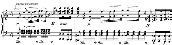

Plays a single note or a pattern defined by an array of frequency/period/pause triplets through a passive piezo speaker or a standard speaker.

But it's more useful than that. By using the onNote() connector the player machine can be used to drive other machines or process any task at the intervals given in the pattern array. The onFinish() connector allows for chaining different patterns into 'songs'.

Note that the Arduino tone() command cannot control more than one pin at the same time so playing music on two player machines at the same time unfortunately won't work.



<!-- md-tocify-begin -->
* [begin()](#atm_player--begin-int-pin---1-)  
* [play()](#atm_player--play-int-pat-int-patsize-)  
* [repeat()](#atm_player--repeat-int-v-)  
* [speed()](#atm_player--speed-int-v-)  
* [pitch()](#atm_player--pitch-int-v-)  
* [start()](#atm_player--start)  
* [stop()](#atm_player--stop)  
* [onNote()](#atm_player--onnote-connector-connector-arg-)  
* [onFinish()](#atm_player--onfinish-connector-connector-arg-)  
* [trace()](#atm_player--trace-stream--stream-)  
* [EVT_START](#evt_start)  
* [EVT_STOP](#evt_stop)  
* [EVT_TOGGLE](#evt_toggle)  

<!-- md-tocify-end -->

## Synopsis ##

```c++
#include <Automaton.h>

Atm_player player;
Atm_button button;

int pattern[] = { 
  440, 100, 0, // Frequency, Duration, Pause triplets
  587, 100, 0,
  880, 100, 100,
};

void setup() {
  // Piezo speaker on pin 4
  player.begin( 4 ) 
    .play( pattern, sizeof( pattern ) );
  // Button on pin 2
  button.begin( 2 )
    .onPress( player, player.EVT_START ); // Linked by an event
}

void loop() {
  automaton.run();
}
```

### Atm_player & begin( int pin = -1 ) ###

Initializes a player machine. If the pin argument is greater than -1 the machine will drive a piezo speaker connected to that pin through the Arduino tone() function. Leave out the pin argument if you want to drive something else through the onNote() connector.

```c++
void setup() {
 
  player.begin() 
    .play( pattern, sizeof( pattern ) )
    .onNote( true, led, led.EVT_ON )
    .onNote( false, led, led.EVT_OFF )
    .start();

}


```

### Atm_player & play( int* pat, int patsize ) ###

Sets a pattern to be played by the player machine. The pattern should be an array of int with 3 entries for every tone.

Index | Function
---- | ----
0 | Frequency in herz
1 | Duration of note on
2 | Duration of note off

The patsize argument contains the total number of *bytes* in the pattern array.

The onFinish() connector can be used to chain different patterns together from a callback handler.

### Atm_player & play( int freq, int period, int pause = 0 ) ###

Plays a single tone through the piezo speaker.

Argument | Function
---- | ----
freq | Frequency in herz
period | Duration of note on in milliseconds
pause | Duration of note off in milliseconds

```c++
void setup() {

  player.begin( 4 ) 
    .play( 440, 200 ); // Play a 440 hz tone for 200 ms

  button.begin( 2 )
    .onPress( player, player.EVT_START ); // When the button is pressed
}

```

### Atm_player & repeat( int v ) ###

Specifies how often the pattern should be repeated. Default is once (1). 
After the last repeat has finished the onFinish() connector is called.

### Atm_player & speed( int v ) ###

Modifies the speed of the pattern, value is a percentage.
At speed( 100 ) - the default - everything plays at the speed specified in the pattern array, at 50 everything plays at half speed, at 300 everything plays at triple speed, etc... 

The example below displays a pulsing led pattern on pins 4..9 defined by a bitmapped player pattern. The speed of the display can be controlled with a potmeter on pin A0 from 50% to 500% of the default pattern speed.

```c++
#include <Automaton.h>

Atm_player player; // A player machine
Atm_analog speed; // An analog machine for the potmeter

const int ledPinMin = 4; // Use pins 4..9
const int ledPinMax = 9; 
const int speedPotPin = A0;
const int speedMin = 50;
const int speedMax = 500;

int pattern[] = {  // Bitmapped pattern
  B00000000, 100, 0, 
  B00001100, 100, 0, 
  B00011110, 100, 0, 
  B00111111, 100, 0, 
  B00011110, 100, 0, 
  B00001100, 100, 0, 
};

void setup() {
  player.begin() // No sound this time!
    .play( pattern, sizeof( pattern ) ) //  Set up the pattern
    .onNote( true, []( int idx, int v, int up ) { // Called on every note
      for ( int i = ledPinMin; i <= ledPinMax; i++ ) {
        pinMode( i, OUTPUT ); // LED on/off according to bit  
        digitalWrite( i, v & ( 1 << ( i - ledPinMin ) ) ? HIGH : LOW ); 
      }    
    })
    .repeat( -1 ) // Repeat forever
    .start(); // Kickoff!
  speed.begin( speedPotPin ) 
    .range( speedMin, speedMax ) // Set the range for the pot values
    .onChange( []( int idx, int v, int up ) {
      player.speed( v ); // Set speed on every change of the potmeter
    });
}

void loop() {
  automaton.run();
}
```

Note that this time we don't use state machines to represent the leds. There's no need to since we're just switching them on and off and this way we need only 2 state machines instead of 10. State machines are a great tool, but there's no need to go overboard on them.

### Atm_player & pitch( int v ) ###

Modifies the pattern frequencies, value is a percentage.
At speed( 100 ) - the default - everything plays at the frequency specified in the pattern array, at 50 everything plays at half the frequency, at 300 everything plays at triple frequency, etc... 

```c++
#include <Automaton.h>

// Vary pitch and speed of a note by turning a pot

Atm_player player;
Atm_analog pot;

void setup() {
  player.begin( 19 )
    .play( 440, 100, 100 )
    .repeat( -1 )
    .start();
  pot.begin( A0 )
    .range( 30, 500 )
    .onChange( []( int idx, int v, int up ) {
       player.speed( v );
       player.pitch( v );
    });
}

void loop() {
  automaton.run();
}
```

### Atm_player & start() ###

Starts the player.

### Atm_player & stop() ###

Stops the player.

### Atm_player & onNote( {connector}, {connector-arg} ) ###

This is where it gets interesting. By using the onNote() connector the player machine can be used to drive other machines or process any task at the intervals given in the pattern array. The frequency value (which may very well contain something totally different) is passed on to a callback in the *v* argument.

```c++
void setup() {

  led.begin( 4 );
  
  player.begin()
    .play( pattern, sizeof( pattern ) )
    .onNote( true, led, led.EVT_ON ) // On note on
    .onNote( false, led, led.EVT_OFF ) // On note off
    .start();
}
```

The example below uses a callback combined with bitmapped values in the pattern/frequency field to trigger two solenoid valves in a particular order.

```c++

#include <Automaton.h>

Atm_player player;
Atm_button button;
Atm_led valve1, valve2;

int pattern[] = { 
  B00000001,  10, 0, // Frequency, Duration, Pause triplets
  B00000011, 980, 0,
  B00000001,  10, 0,
  B00000000,   0, 0,
};

// Open and close two solenoid valves in this order
// Valve 1: ___|^^^^^^^^|____
// Valve 2: ____|^^^^^^|_____

void setup() {
  valve1.begin( 4 );
  valve2.begin( 5 );
  player.begin() 
    .play( pattern, sizeof( pattern ) )
    .onNote( true, []( int idx, int v, int up ) {
      valve1.trigger( v & B00000001 > 0 ? valve1.EVT_ON : valve1.EVT_OFF );
      valve2.trigger( v & B00000010 > 0 ? valve2.EVT_ON : valve2.EVT_OFF );	  
    });
  button.begin( 2 )
    .onPress( player, player.EVT_START );
}

void loop() {
  automaton.run();
}
```

You can easily control 8 or more valves this way. 

### Atm_player & onFinish( {connector}, {connector-arg} ) ###

A connector that is called when playing stops (after the last repeat of a pattern has finished).

The code below uses onFinish() to chain two different patterns together.

```c++
#include <Automaton.h>

Atm_player player;
Atm_button button;

int pattern1[] = { // Odd pattern
  440, 100, 0, 
  587, 100, 0,
  880, 100, 100,
};

int pattern2[] = { // Even pattern
  880, 100, 0, 
  587, 100, 0,
  440, 100, 100,
};

void callback( int idx, int v, int up ) {
  static int cnt = 0;
  if ( cnt % 2 == 0 ) {
    player.play( pattern2, sizeof( pattern2 ) ); // Even counts
  } else {
    player.play( pattern1, sizeof( pattern1 ) ).trigger( player.EVT_STOP ); // Odd counts
  }
  cnt++;  
}

void setup() {

  player.begin( 4 ) 
    .play( pattern1, sizeof( pattern1 ) )
    .onFinish( callback );

  button.begin( 2 )
    .onPress( player, player.EVT_TOGGLE );
}

void loop() {
  automaton.run();
}
```

### Atm_player & trace( Stream & stream ) ###

To monitor the behavior of this machine you may log state change events to a Stream object like Serial.

```c++
Serial.begin( 9600 );
player.trace( Serial );
```

### EVT_START ###

The player machine starts playback on receipt of this event.

```c++
  player.trigger( player.EVT_START );
```

### EVT_STOP ###

The player machine stops playback on receipt of this event.

```c++
  player.trigger( player.EVT_STOP );
```

### EVT_TOGGLE ###

The player machine toggle playback on or off on receipt of this event.

```c++
  player.trigger( player.EVT_TOGGLE );
```
