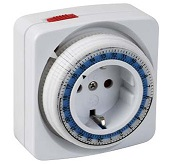

Atm_timer implements a timer mechanism as a simple state machine. Atm_timer works around the millis() rollover to support intervals of up to 136.2 years. Note that contrary to earlier versions, the timer object does not automatically start the timer after the begin() method call. It requires an EVT_START trigger to start.



<!-- md-tocify-begin -->
* [begin()](#atm_timer--begin-int-ms--0-)  
* [onTimer()](#atm_timer--ontimer-connector-connector-arg-)  
* [interval_millis()](#atm_timer--interval_millis-int-v-)  
* [interval_seconds()](#atm_timer--interval_seconds-int-v-)  
* [interval()](#atm_timer--interval-int-v-)  
* [repeat()](#atm_timer--repeat-int-v-)  
* [EVT_START](#evt_start)  
* [EVT_STOP](#evt_stop)  
* [EVT_TOGGLE](#evt_toggle)  
* [trace()](#atm_timer--trace-stream--stream-)  

<!-- md-tocify-end -->

## Synopsis ##

```c++
#include <Automaton.h>

Atm_timer timer;

void timer_callback( int idx, int v, int up ) {
  // Something to do when the timer goes off
}

void setup() {
  timer.begin( 2000 )
    .repeat( 2 )
    .onTimer( timer_callback )
    .trigger( timer.EVT_START );
}

void loop() {
  automaton.run();
}
```

### Atm_timer & begin( int ms = 0 ) ###

The begin() method has one optional argument, the interval in milliseconds.

```c++
void setup() {
  timer.begin();
  ...
  timer.begin( 2000 ).trigger( timer.EVT_START );
  ...
}
```

The default for the interval argument is 0, which effectively turns the timer into a passthrough machine. Any EVT_START event that is received is immediately turned into the onTimer() action.

```c++
void setup() {
  led.begin( 4 );

  timer.begin()
    .onTimer( led, led.EVT_ON )
    .trigger( timer.EVT_START ); // Turns the led on immediately
}
```
Combining a null timer with repeat() can generate multiple events. In the example below, a single EVT_START sent to the timer will turn on 4 leds through the step sequencer without delay.

```c++
#include <Automaton.h>

Atm_step step;
Atm_led led[6];
Atm_timer timer;

void setup() {
  step.begin();
  for ( short i = 0; i <= 5; i++ ) {
    led[i].begin( 4 + i ); // Pins 4, 5, 6, 7, 8, 9
    step.onStep( i, led[i], Atm_led::EVT_ON ); // Create a step for each led
  }
  timer.begin()
    .repeat( 4 )
    .onTimer( step, Atm_step::EVT_STEP ) 
    .trigger( timer.EVT_START ); // Triggers 4 EVT_STEP events!
}

void loop() {
  automaton.run();
}
```

Note that unlike earlier versions, the timer machine requires a EVT_START trigger to actually start the timer!

### Atm_timer & onTimer( {connector}, {connector-arg} ) ###

Registers a callback to be called when the timer expires with the specified idx argument. Alternatively registers a state machine object to be triggered and the event type to be trigger.

```c++
timer.onTimer( timer_callback );

timer.onTimer( door, door.EVT_OPEN );
```

### Atm_timer & interval_millis( int v ) ###

Sets the timer interval, the period after which the timer is fired. The value of *v* is in milliseconds. By default the timer is fired only once after which the timer machine goes to sleep.

```c++
timer.interval( 2000 ); // Wait for 2 seconds
timer.repeat( 2 );
```

Legal values are:

Value | Function
----- | -----
0 | Timer always returns true
1..4294967294 | Returns true if state has been active for at least that many millis
4294967295 | Always returns false (ATM_TIMER_OFF constant)

The interval_millis() method can specify intervals of up to 4294967294 milliseconds (49.7 days)

### Atm_timer & interval_seconds( int v ) ###

Sets the timer interval, the period after which the timer is fired. The value of *v* is in seconds. By default the timer is fired only once after which the timer machine goes to sleep.

```c++
timer.interval_seconds( 2000 ); // Wait for 2000 seconds
timer.repeat( 2 );
```

Legal values are:

Value | Function
----- | -----
0 | Timer always returns true
1..4294967294 | Returns true if state has been active for at least that many seconds
4294967295 | Always returns false (ATM_TIMER_OFF constant)

The interval_seconds() method can specify intervals of up to 4294967294 seconds (about 136.2 years)

### Atm_timer & interval( int v ) ###

Synonym of interval_millis().

### Atm_timer & repeat( int v ) ###

Sets the number of times the timer will be repeated. Default is 1. If you set this value to *ATM_COUNTER_OFF* (-1) the timer will repeat indefinitely.

```c++
timer.interval( 2000 );
timer.repeat( 2 );
```

### Atm_timer & start() ###

Starts the timer.

### Atm_timer & stop() ###

Stops the timer.

### EVT_START ###

Turns an idle timer on or resets a running timer.

```c++
timer.trigger( timer.EVT_START );
```

### EVT_STOP ###

Turns a running timer off.
Does not trigger the onFinish() connector.

```c++
timer.trigger( EVT_STOP );
```

### EVT_TOGGLE ###

Turns a running timer off and an idle timer on.
Does not trigger the onFinish() connector.

```c++
void setup() {
  ...
  timer.begin( 100 )
    .repeat( -1 );

  button.begin( 2 )
    .onPress( timer, timer.EVT_TOGGLE );
  ...
}
```


### Atm_timer & trace( Stream & stream ) ###

To monitor the behavior of this machine you may log state change events to a Stream object like Serial. Open the Arduino IDE's serial monitor to see the log messages.

```c++
Serial.begin( 9600 );
timer.trace( Serial );
```
